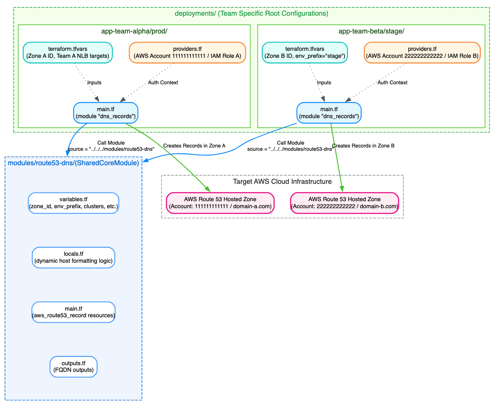

# Route53-records-update-using-Terraform
A production-grade, multi-team Terraform architecture for managing AWS Route 53 DNS records across multiple domains, environments, and AWS accounts.
This repository decouples core DNS management logic into a reusable shared module (`modules/route53-dns`) while allowing engineering teams to manage their independent DNS states in isolated deployment roots (`deployments/`).

---

## Key Features

* **Multi-Account & Multi-Domain Support:** Provider settings are defined in team deployments rather than the module, allowing cross-account deployments via `assume_role`.

* **Configurable Environment Prefixing:** Accepts `env_prefix` (e.g., `prod`, `stage`, `dev`) so teams can re-use naming rules across non-production environments.

* **Dynamic Cluster Expansion:** Expands `clusters` maps into contiguous microservice endpoints (msapp1 and msapp2) using zero-padded indexing.

* **Complete DNS Type Coverage:** Manages `A`, `CNAME`, `TXT`, `MX`, `SRV`, and AWS native `ALIAS` records within a single cohesive interface.

---

## Architecture Overview


---
## Repository Layout

```text
terraform-dns-management/
├──Route53-DNS-update.png
├── modules/
│   └── route53-dns/                  # Core Reusable Module
│       ├── main.tf                   # Route53 record resources (A, CNAME, TXT, MX, SRV, ALIAS)
│       ├── locals.tf                 # Dynamic string formatting & flattening logic
│       ├── variables.tf              # Strongly typed module inputs
│       └── outputs.tf                # Generated FQDN outputs
│
└── deployments/                      # Team Deployment Environments
    ├── app-team-alpha/
    │   └── prod/
    │       ├── main.tf               # Module instantiation
    │       ├── providers.tf          # Provider setup & cross-account IAM role assume
    │       ├── variables.tf          # Root configuration inputs
    │       ├── outputs.tf            # Root outputs
    │       └── terraform.tfvars      # Team Alpha environment values
    │
    └── app-team-beta/                #Team Beta(Sample structure, NOT POPULATED)
        └── stage/
            ├── main.tf
            ├── providers.tf
            ├── variables.tf
            └── terraform.tfvars
```
---
## Prerequisites
* Terraform: `v1.3.0` or higher
* AWS CLI: Configured with credentials possessing Route 53 record management permissions.
* IAM Policy Required:
  ```text
  {
  "Version": "2012-10-17",
  "Statement": [
    {
      "Effect": "Allow",
      "Action": [
        "route53:ChangeResourceRecordSets",
        "route53:ListResourceRecordSets",
        "route53:GetHostedZone"
      ],
      "Resource": "arn:aws:route53:::hostedzone/*"
    }
  ]
}
```
---
### Deployment Guide for Teams
1. Directory Setup
Create a dedicated directory under the `deployments/` folder for your team and target environment:

```text
mkdir -p deployments/app-team-alpha/prod
cd deployments/app-team-alpha/prod
```
2. Define Credentials & Module Call
   Create `main.tf` to reference the shared core module:

3. Configure Environment `.tfvars`
Create `terraform.tfvars` with team-specific identifiers:

4. Execute Terraform Pipeline
```text
# Initialize and download module dependencies
terraform init

# Validate syntax and formatting
terraform fmt -check
terraform validate

# Plan deployment
terraform plan

# Deploy DNS records
terraform apply
```
**Cross-Account Deployment Pattern**
If your team's Route 53 Hosted Zone exists in a dedicated core networking account or team-specific AWS account, configure `providers.tf` in your deployment root to assume a target role:
